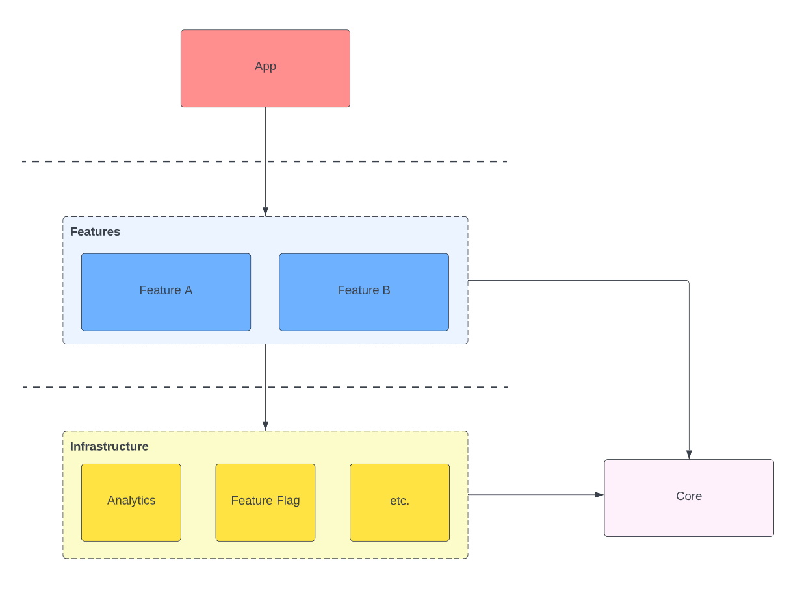
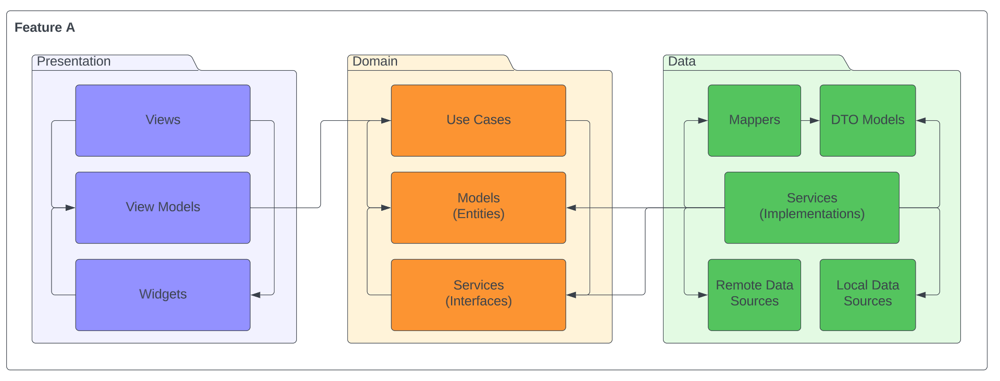

# GoSnack Client

<!-- TODO: Introdução -->

<!-- TODO: Como executar o projeto -->

---

## 📁 Project Structure

Este projeto segue uma abordagem **Feature-First + Clean Architecture** para organizar o código de forma modular, escalável e de fácil manutenção.

> Referência: https://medium.com/@remy.baudet/feature-first-clean-architecture-for-flutter-246366e71c18

### Visão Geral

<!-- Gerar árvore mais facilmente: https://devtool.tech/en/tree -->

```bash
gosnack_client/
├── assets/
│   └── ...
├── docs/
│   ├── diagrams/
│   │   └── ...
│   └── screenshots/
│       └── ...
├── lib/
│   ├── core/
│   │   └── ...
│   ├── features/
│   │   └── ...
│   ├── app.dart
│   ├── firebase_options.dart
│   └── main.dart
├── android/
├── ios/
├── linux/
├── macos/
├── web/
├── windows/
├── .gitignore
├── .metadata
├── README.md
├── analysis_options.yaml
├── flutter_launcher_icons.yaml
├── flutter_native_splash.yaml
├── pubspec.lock
└── pubspec.yaml
```

<!-- Explicação -->

| Path/File                     | Descrição                                                                                                                                                                 |
| :---------------------------- | :------------------------------------------------------------------------------------------------------------------------------------------------------------------------ |
| `assets/`                     | Contém todos os **static assets** (imagens, ícones, fontes, animações e logos) registrados no `pubspec.yaml`                                                              |
| `docs/`                       | Documentação de suporte ao projeto, utilizada para entendimento da arquitetura, fluxos e apresentação.                                                                    |
| `docs/diagrams/`              | Diagramas técnicos (UML, arquitetura, casos de uso, classes, fluxos de navegação).                                                                                        |
| `docs/screenshots/`           | Capturas de tela da aplicação para README, portfólio e documentação visual.                                                                                               |
| `lib/`                        | Código-fonte principal da aplicação Flutter.                                                                                                                              |
| `lib/core/`                   | Camada compartilhada e (cross-cutting): configurações globais, tema, roteamento, injeção de dependências, widgets reutilizáveis, etc.                                     |
| `lib/features/`               | Implementação das funcionalidades organizadas por domínio funcional (Feature-First).                                                                                      |
| `lib/app.dart`                | Configuração raiz da aplicação, incluindo tema, rotas, bindings globais e configurações de navegação.                                                                     |
| `lib/firebase_options.dart`   | Arquivo gerado pelo **FlutterFire CLI** contendo as configurações de plataforma necessárias para inicializar o Firebase.                                                  |
| `lib/main.dart`               | Entry point da aplicação. Inicializa dependências e executa o `runApp`.                                                                                                   |
| `android/`                    | Código e configurações nativas específicas para a plataforma Android.                                                                                                     |
| `ios/`                        | Código e configurações nativas específicas para a plataforma iOS.                                                                                                         |
| `.gitignore`                  | Define arquivos e diretórios que não devem ser versionados pelo Git.                                                                                                      |
| `.metadata`                   | Metadados gerados automaticamente pelo Flutter. Não deve ser modificado manualmente.                                                                                      |
| `analysis_options.yaml`       | Configuração de lint rules e análise estática do Dart para padronização e qualidade de código.                                                                            |
| `flutter_launcher_icons.yaml` | Configuração do pacote [`flutter_launcher_icons`](https://pub.dev/packages/flutter_launcher_icons) que gera automaticamente os ícones do aplicativo para cada plataforma. |
| `flutter_native_splash.yaml`  | Configuração do pacote [`flutter_native_splash`](https://pub.dev/packages/flutter_native_splash) que gera automaticamente a splash screen do aplicativo.                  |
| `pubspec.lock`                | Arquivo gerado automaticamente que fixa as versões exatas das dependências instaladas.                                                                                    |
| `pubspec.yaml`                | Arquivo principal do projeto: define dependências, assets, fonts e configurações gerais do Flutter.                                                                       |



### Pasta `assets/`

```bash
gosnack_client/assets/
├── animations/
├── fonts/
├── images/
│   ├── backgrounds/
│   ├── illustrations/
│   └── placeholders/
└── logos/
```

| Path                    | Descrição                                                                             |
| :---------------------- | :------------------------------------------------------------------------------------ |
| `animations/`           | Animações Lottie em `.json`.                                                          |
| `fonts/`                | Fontes customizadas em `.ttf`                                                         |
| `images/`               | Imagens estáticas em `.png`, `.jpg`, etc.                                             |
| `images/backgrounds/`   | Imagens de fundo para telas e seções.                                                 |
| `images/illustrations/` | Ilustrações para onboarding, empty states, etc.                                       |
| `images/placeholders/`  | Imagens genéricas para placeholders e erros.                                          |
| `logos/`                | Logotipos da marca em diferentes variações para o app, launcher icon e splash screen. |

### Pasta `lib/core/`

O diretório `core` contém componentes compartilhados, infraestrutura e configurações globais utilizadas por toda a aplicação. Nenhuma lógica específica de feature deve ser adicionada aqui.

```bash
gosnack_client/lib/core/
├── config/
│   └── firestore
│       ├── fields/
│       │   └── ...
│       ├── collections.dart
│       └── firestore_paths.dart
├── constants/
│   ├── styles/
│   │   ├── border.dart
│   │   ├── colors.dart
│   │   ├── shape.dart
│   │   ├── sizes.dart
│   │   └── spacing.dart
│   └── enums.dart
├── di/
│   └── app_bindings.dart
├── errors/
│   ├── firebase_exception.dart
│   └── no_internet_exception.dart
├── localization/
├── logging/
│   └── logger.dart
├── network/
│   ├── http_client.dart
│   └── network_manager.dart
├── resources/
│   ├── icons/
│   │   └── icons.dart
│   ├── images/
│   │   ├── animations_paths.dart
│   │   └── images_paths.dart
│   └── strings/
│       ├── error_texts.dart
│       └── main_texts.dart
├── routing/
│   ├── app_routes.dart
│   └── routes.dart
├── theme/
│   ├── base/
│   │   ├── color_scheme.dart
│   │   └── typography.dart
│   ├── widgets_theme/
│   │   └── ...
│   └── theme.dart
├── utils/
│   ├── device_utility.dart
│   └── helper_functions.dart
└── widgets/
    └── ...
```

| Path/File                                | Descrição                                                                                                 |
| :--------------------------------------- | :-------------------------------------------------------------------------------------------------------- |
| `config/`                                | Configurações de integração com serviços externos e definição de caminhos utilizados pela aplicação.      |
| `config/firestore/`                      | Centraliza a estrutura e os caminhos utilizados no Cloud Firestore.                                       |
| `config/firestore/fields/`               | Constantes com os nomes dos campos das coleções.                                                          |
| `config/firestore/collections.dart`      | Constantes com os nomes das coleções do Firestore.                                                        |
| `config/firestore/firestore_paths.dart`  | Métodos utilitários para construção de paths de documentos e coleções.                                    |
| `constants/`                             | Constantes globais reutilizáveis em toda a aplicação.                                                     |
| `constants/styles/`                      | Tokens de design (Design System) como cores, espaçamentos, bordas, tamanhos e formas.                     |
| `constants/enums.dart`                   | Enumerações globais utilizadas em diferentes partes do projeto.                                           |
| `di/`                                    | Configuração de **injeção de dependências (Dependency Injection)** utilizando GetX Bindings.              |
| `di/app_bindings.dart`                   | Registro das dependências globais da aplicação.                                                           |
| `errors/`                                | Definição de exceções customizadas e tratamento padronizado de erros.                                     |
| `errors/firebase_exception.dart`         | Mapeamento e abstração de erros provenientes do Firebase.                                                 |
| `errors/no_internet_exception.dart`      | Exceção para cenários de ausência de conectividade.                                                       |
| `localization/`                          | Estrutura para internacionalização (i18n) e gerenciamento de traduções.                                   |
| `logging/`                               | Infraestrutura de logging para depuração e monitoramento.                                                 |
| `logging/logger.dart`                    | Configuração central do sistema de logs.                                                                  |
| `network/`                               | Camada de comunicação de rede e monitoramento de conectividade.                                           |
| `network/http_client.dart`               | Cliente HTTP configurado para requisições externas.                                                       |
| `network/network_manager.dart`           | Gerencia o estado da conexão de internet.                                                                 |
| `resources/`                             | Acesso centralizado a recursos estáticos da aplicação.                                                    |
| `resources/icons/icons.dart`             | Mapeamento de ícones (HugeIcons) utilizados na aplicação.                                                 |
| `resources/images/animations_paths.dart` | Caminhos tipados para animações (Lottie).                                                                 |
| `resources/images/images_paths.dart`     | Caminhos tipados para imagens estáticas.                                                                  |
| `resources/strings/`                     | Textos estáticos da aplicação organizados por categoria (textos principais, mensagens de erro, etc.).     |
| `routing/`                               | Configuração de navegação utilizando GetX.                                                                |
| `routing/app_routes.dart`                | Definição das rotas nomeadas da aplicação.                                                                |
| `routing/routes.dart`                    | Configuração das páginas e bindings associados a cada rota.                                               |
| `theme/`                                 | Configuração do tema global da aplicação.                                                                 |
| `theme/base/`                            | Definições base de estilo como esquema de cores e tipografia.                                             |
| `theme/widgets_theme/`                   | Customizações de tema para widgets específicos do Material.                                               |
| `theme/theme.dart`                       | Configuração principal do `ThemeData` da aplicação.                                                       |
| `utils/`                                 | Funções utilitárias e helpers reutilizáveis.                                                              |
| `utils/device_utility.dart`              | Funções relacionadas a informações do dispositivo e responsividade.                                       |
| `utils/helper_functions.dart`            | Funções auxiliares genéricas.                                                                             |
| `widgets/`                               | Widgets reutilizáveis e componentes de interface compartilhados entre diferentes telas e funcionalidades. |

<!-- Features -->

### Pasta `lib/features/`

Cada funcionalidade é organizada por módulo independente seguindo a estrutura:

```bash

```


